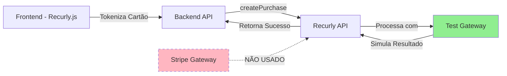

# Status do Gateway de Pagamento - Análise Atual

## 🔍 Resposta Direta

**Seu projeto está APENAS TESTANDO o ambiente do Recurly, NÃO está enviando transações para o Stripe.**

## 📊 Evidências

### 1. Chave Pública Recurly
```typescript
// RecurlyWrapper.tsx
<RecurlyProvider publicKey="ewr1-51YSZZAboXiIyzSYrp9zL0">
```

- **Prefixo `ewr1`**: Indica região EU (European Union) do Recurly
- **Tipo de chave**: Chave pública do Recurly (não do Stripe)
- **Ambiente**: Não é possível determinar se é teste ou produção apenas pela chave

### 2. Transação de Teste Bem-Sucedida

Conforme a imagem fornecida:
- ✅ Transação marcada como "Test Transaction"
- ✅ Status: Success
- ✅ Origin: Recurly.js
- ✅ Valor: $5.00 USD

### 3. Status do Stripe

Conforme a segunda imagem:
- ⚠️ **"Your Stripe account is active, but not ready to accept live payments"**
- 📍 Live Mode: **False** (apenas transações de teste)
- 💳 Accepted Currencies & Cards: Brazilian Real configurado

## 🎯 O Que Isso Significa?

### Atualmente Você Está Usando:

1. **Test Gateway do Recurly**
   - Gateway de simulação interno do Recurly
   - Não processa transações reais
   - Não envia dados para o Stripe
   - Útil para testar a integração sem configurar gateway real

2. **Stripe Configurado mas Inativo**
   - Conta Stripe existe e está conectada ao Recurly
   - Configurada para modo sandbox/teste
   - **NÃO está processando transações** (nem de teste, nem reais)

## 🔄 Como Funciona o Fluxo Atual



## ✅ Para Enviar Transações para o Stripe

Você precisa seguir estes passos:

### 1. Ativar o Gateway Stripe no Recurly

**Acesse o painel do Recurly:**
1. Configuration → Payment Gateways
2. Clique em "Add Gateway"
3. Selecione "Stripe"
4. Insira as credenciais do Stripe:
   - **Test Mode**: Use chaves `sk_test_...` e `pk_test_...`
   - **Live Mode**: Use chaves `sk_live_...` e `pk_live_...`

### 2. Definir Stripe como Gateway Padrão

No Recurly Admin:
1. Vá para Payment Gateways
2. Encontre o gateway Stripe que você adicionou
3. Clique em "Make Default"
4. Salve as alterações

### 3. Remover ou Desativar Test Gateway

Para garantir que as transações vão para o Stripe:
1. Desative o "Test Gateway" no Recurly
2. Ou configure routing para usar Stripe

### 4. Testar com Cartões de Teste do Stripe

Use os cartões de teste do Stripe (não do Recurly):
- **Sucesso**: `4242 4242 4242 4242`
- **Falha**: `4000 0000 0000 0002`
- **3D Secure**: `4000 0027 6000 3184`

## 🚀 Modo Sandbox vs Produção

### Sandbox (Recomendado para Começar)

```env
# Stripe Test Keys
STRIPE_SECRET_KEY=sk_test_...
STRIPE_PUBLISHABLE_KEY=pk_test_...
```

- ✅ Transações simuladas
- ✅ Sem cobranças reais
- ✅ Dados de teste
- ✅ Ideal para desenvolvimento

### Produção (Quando Pronto)

```env
# Stripe Live Keys
STRIPE_SECRET_KEY=sk_live_...
STRIPE_PUBLISHABLE_KEY=pk_live_...
```

- 💰 Transações reais
- 💳 Cobranças reais nos cartões
- 📊 Dados reais de clientes
- ⚠️ Requer compliance e segurança

## 📋 Checklist para Go Live com Stripe

Conforme [documentação oficial do Recurly](https://docs.recurly.com/recurly-subscriptions/docs/go-live):

- [ ] Conta Stripe verificada e ativada
- [ ] Gateway Stripe configurado no Recurly (modo teste)
- [ ] Testes realizados com cartões de teste do Stripe
- [ ] Webhooks configurados (se necessário)
- [ ] Statement descriptor configurado
- [ ] Moedas e métodos de pagamento configurados
- [ ] Testes de reembolso realizados
- [ ] Trocar para chaves de produção do Stripe
- [ ] Ativar modo live no Recurly
- [ ] Fazer transação real de teste com valor mínimo

## 🔗 Recursos Úteis

- [Documentação Stripe + Recurly](https://docs.recurly.com/recurly-subscriptions/docs/stripe)
- [Test Gateway do Recurly](https://docs.recurly.com/recurly-subscriptions/docs/test)
- [Go Live Checklist](https://docs.recurly.com/recurly-subscriptions/docs/go-live)
- [Cartões de Teste do Stripe](https://stripe.com/docs/testing)

## 💡 Próximo Passo Recomendado

**Configurar Stripe em modo sandbox** para começar a processar transações de teste através do Stripe (em vez do Test Gateway do Recurly). Isso permitirá:

1. Validar a integração completa Recurly → Stripe
2. Ver transações no dashboard do Stripe
3. Testar webhooks e eventos do Stripe
4. Simular cenários reais antes de ir para produção
